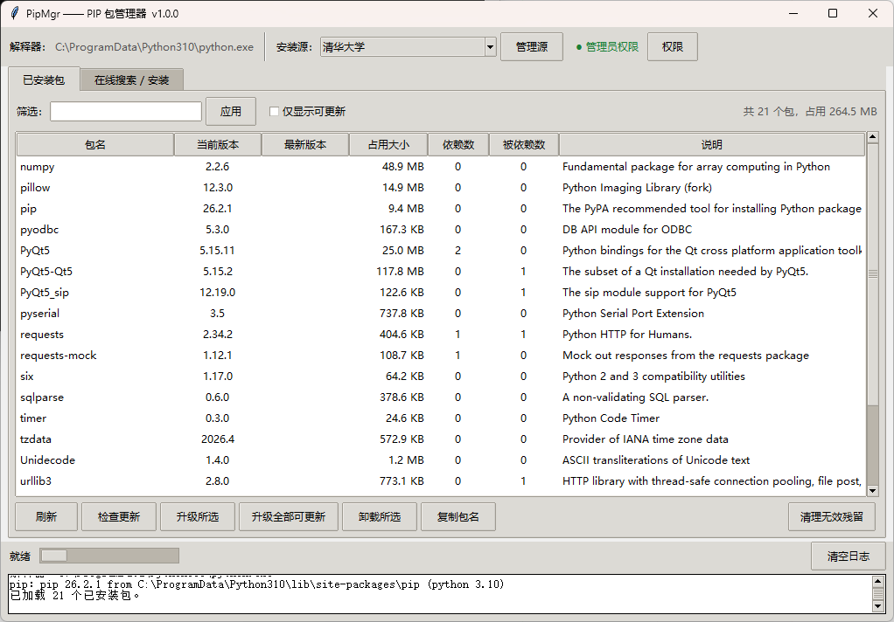
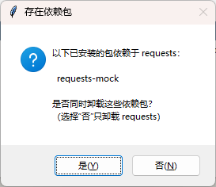
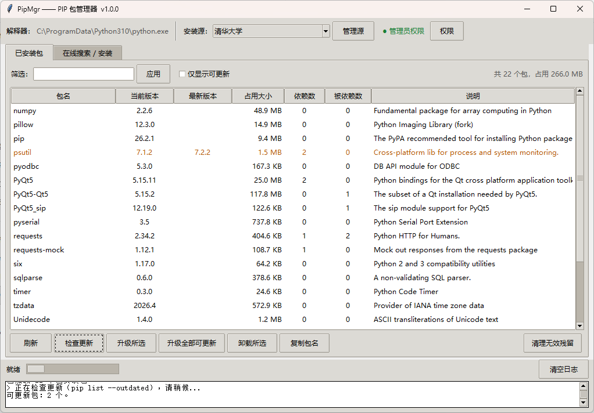
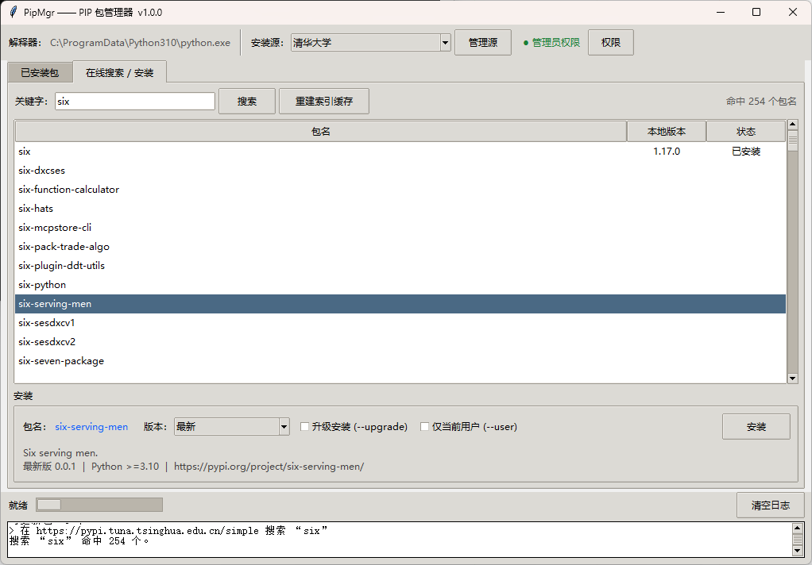
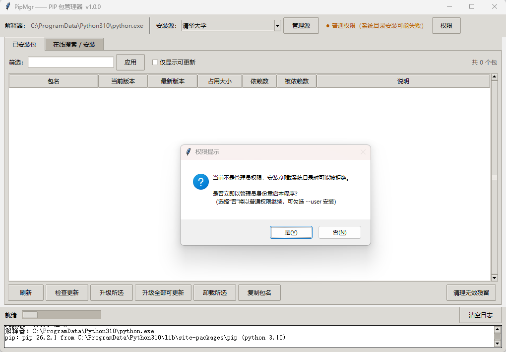

# PIP 包管理器 GUI

> 使用 Python 标准库 `tkinter` 实现的图形化 pip 包管理工具。
> 启动时提示以管理员权限运行，所有操作不依赖任何第三方库。

| 项目       | 内容                       |
| ---------- | -------------------------- |
| 名称       | PIP 包管理器 GUI           |
| 版本       | 1.0.0                      |
| 作者       | thriken                    |
| 运行要求   | Python 3.8+                |
| 依赖       | 仅标准库（tkinter / importlib.metadata） |

---

## 功能特性

| #   | 功能                                                         | 说明                                                         |
| --- | ------------------------------------------------------------ | ------------------------------------------------------------ |
| 1   | 列出已安装包                                                 | 显示包名、版本、占用磁盘大小、依赖包数量                     |
| 2   | 升级 / 卸载                                                  | 支持批量操作；存在依赖时提示是否一并卸载                     |
| 3   | 在线搜索与安装                                               | 多源模糊搜索，可选择版本安装                                 |
| 4   | 多源管理                                                     | 内置清华 / 阿里 / 中科大 / 豆瓣 / PyPI 官方，支持自定义      |
| 5   | 清理无效残留                                                 | 一键还原 pip 中断卸载产生的 `~` 前缀目录，恢复可卸载状态     |

---

## 快速开始

```bash
python main.py           # 或双击 启动.bat
python -m pipmgr         # 也可作为模块启动
```

- 要求 **Python 3.8+**，无需安装任何第三方库。
- 所有 pip 操作统一使用 `sys.executable -m pip`，避免多 Python 环境下调错 pip。

---

## 项目结构

```
main.py               入口脚本
start.bat              一键启动（Windows） python main.py可换成pythonw main.py无控制台窗口
pipmgr/
  __init__.py         包标识
  __main__.py         模块启动入口（python -m pipmgr）
  config.py           应用目录、pip 源配置、管理员权限检测与 UAC 提权
  pkgs.py             读取已安装包：版本 / 磁盘占用 / 依赖关系 / 残留修复
  pipwrap.py          pip 命令封装：安装 / 升级 / 卸载 / 检查更新
  index.py            多源 Simple 索引搜索与版本列表
  ui.py               Tkinter 界面（已安装页 / 在线安装页 / 日志）
```

---

## 使用说明

### 已安装包

- 列出本机所有已安装包，包含版本、占用大小、依赖数与被依赖数。
- 双击某行可查看其**依赖**与**被依赖**明细。
- 支持按列排序、关键字筛选，以及"仅显示可更新"。



### 升级与卸载

- 支持单选 / 多选后的批量升级、卸载。
- 卸载前会解析反向依赖，列出"谁依赖它"，并询问是否一并卸载。
- 命中 `pip` / `setuptools` / `wheel` 等核心包时会额外告警。




### 在线搜索与安装

- 官方 `pip search`（PyPI XML-RPC）已下线，本工具改为读取各源的 **PEP503 Simple 索引页** 进行模糊搜索。
- 首次搜索会下载索引并缓存 **7 天**，缓存在 `%LOCALAPPDATA%\PipMgr\cache`；
  点击"重建索引缓存"可强制刷新。
- 选中包后可异步拉取可用版本列表与 PyPI 简介，支持指定版本、`--upgrade`、`--user`。



### 多源

- 内置清华、阿里、中科大、豆瓣、PyPI 官方五个源。
- 在"管理源"中可增删自定义源；配置与最近使用记录保存在 `%LOCALAPPDATA%\PipMgr\config.json`。

### 权限

- 非管理员启动时提示是否以管理员身份重启（UAC）。
- 未提权时建议勾选 `--user`，将包安装到用户目录，避免写入系统目录失败。



### 清理无效残留

- pip 在卸载被中断时会把 `xxx.dist-info` 改名为 `~xxx.dist-info` 等 `~` 前缀目录，
  导致该包仍出现在列表中却无法通过 pip 卸载。
- 点击"清理无效残留"可扫描各 site-packages，按原包名还原这些目录，使其恢复正常可卸载状态。
- 若还原时提示权限不足，请以管理员身份运行本程序后重试。

---

## 实现要点

- **占用大小**：依据 `importlib.metadata` 记录的 `RECORD` 文件逐个统计文件大小，
  在后台线程中计算并实时刷新表格。
- **依赖关系**：解析各包的 `Requires-Dist`，构建正向 / 反向依赖表；
  卸载时据此列出受影响的上游包。
- **在线索引**：解析 Simple 索引 HTML 的 `<a>` 标签提取包名；
  版本详情与简介则通过 PyPI JSON 接口获取。
- **零依赖**：界面使用 `tkinter`，包元数据使用 `importlib.metadata`，网络使用 `urllib`，
  全部为 Python 标准库。

---

## 许可证

本工具以 MIT 许可证开源，可自由使用与修改。
